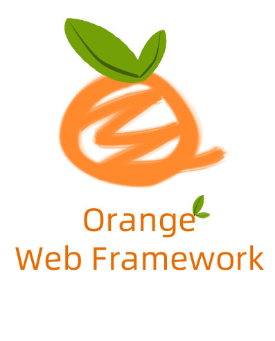

## Orange 开发框架是一款 Golang 语言 web 开发框架

### 主要特性
- 基于 golang 性能不凡；
- MVC 分层设计，逻辑清晰；
- 核心功能短小精悍，灵活度高；
- 丰富的工具包，有 图片验证码，本地缓存，发送邮件，http请求客户端，日志 等常用工具包；
- 持续更新，已应用于多个线上成熟项目；
- 源码地址 [https://gitee.com/zhucheer/orange](https://gitee.com/zhucheer/orange)

### 目录
* [概要](README.md)
* [快速开始](快速开始.md)
* [配置](config/配置.md)
* [日志](log/日志.md)
* [路由](route/路由.md)
* [中间件](route/中间件.md)
* [控制器](controller/控制器.md)
* [视图](view/视图.md)
* [命令行参数](config/命令行参数.md)
* [数据库](#jump1)
    * [Mysq操作](DB/Mysq操作.md)
    * [Redis操作](DB/Redis操作.md)
* [其他](#jump3)
    * [目录接口](base/项目目录.md)
    * [项目编译](base/项目编译.md)
    * [优雅退出](base/优雅退出.md)
* [实用工具](#jump2)
    * [图片验证码](tools/图片验证码.md)
    * [简单队列](tools/简单队列.md)
    * [http请求客户端](tools/http请求客户端.md)
    * [文件上传](tools/文件上传.md)
    * [发送邮件](tools/发送邮件.md)

