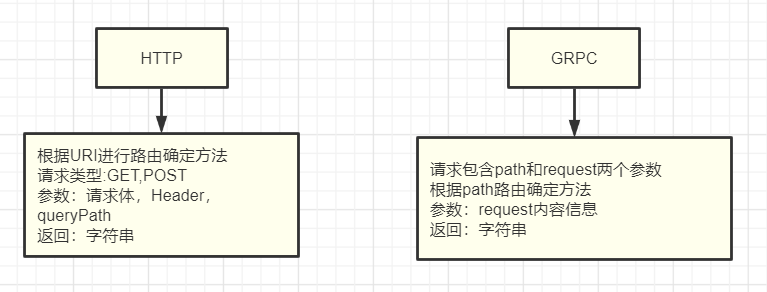

## 日志处理

作为一款微服务框架，通过 GRPC 进行方法调用是业界的标配，Orange 框架目前已经支持 GRPC 服务。

框架内置GRPC服务有如下特点：

- 无需使用者配置额外的 proto 文件；
- 对现有编写模式无感知，通过配置即可将 HTTP 服务对应的方法复刻到 GRPC；
- 对与客户端调用也使用 Orange 框架的应用通过内置 GRPC 客户端将和 HTTP 请求一样快速方便的接入 GRPC

## 原理简述

Orange 框架已经内置了一个通用的 proto 文件，通过该 proto 文件可以满足我们大部分的使用需求，proto 文件详见 [gitee.com/zhucheer/orange/blob/master/grpc/orange.proto](https://gitee.com/zhucheer/orange/blob/master/grpc/orange.proto)。

我们在使用 GRPC 服务时都是直接使用该 proto 文件生成的方法进行操作，该文件中定义了一个和 HTTP 请求类似的结构，只包含 `RequestDo` 一个方法，通过该方法传递请求和返回，平滑的将 HTTP 方法复刻到 GRPC，示意图如下。




## 服务注册

启动 GRPC 服务之前需要注册对应的 GRPC 方法，方法注册只需要在路由中定义 GRPC 或 ALL 路由绑定即可，和现有 HTTP 开发模式一样。

下面两种路由绑定方法都能注册到 GRPC 服务。

定义GRPC请求  `groupName.GRPC("/test", controller.Test)`
定义所有请求  `groupName.ALL("/test", controller.Test)`


## 服务启动

服务启动没有任何改变，配置指定 GPRC 服务端口即可。

设置 GRPC 端口方法一：

修改配置文件 `app.grpcPort : 8089` 


设置 GRPC 端口方法而：

启动程序添加命令行参数  `--grpc=8089` 

配置参数优先级：

命令行参数 > 配置文件


## 客户端调用

服务启动后我们就能通过框架内置的通用方法调用 GRPC 服务了，因内置的 proto 和 pb 文件已经生成好，使用框架内置方法也无需过多了解 proto 使用细节，对刚接入 GRPC 的同学非常友好。

依赖包：`"gitee.com/zhucheer/orange/grpc"`

实例化客户端：`grpc.NewClient()`

链式操作设置客户端地址：`SetSrvAddr("127.0.0.1:8089")`

设置超时时间: `SetTimeout(1)`

请求 GPRC 服务指定绑定的地址：`RunGRPC("/")` ,其中参数就是服务端再路由注册时填的路径。


```
// 引入包
import (
	"gitee.com/zhucheer/orange/grpc"
)

// 指定 GRPC 服务地址和端口
resp, err := grpc.NewClient().SetSrvAddr("127.0.0.1:8089").SetTimeout(1).RunGRPC("/")
```

## 完整的示例

该示例将服务端客户端分别放着两个方法里面，启动后通过 访问`http://127.0.0.1:8088/rpctest ` 后程序回调用自身的 GRPC 服务对应路径为 "/" 的方法，输出 `Hello world!`。

``` golang
package main

import (
	"gitee.com/zhucheer/orange/app"
	"gitee.com/zhucheer/orange/grpc"
)

func main() {
	router := &Route{}
	app.AppStart(router)
}

type Route struct {
}

func (s *Route) ServeMux() {
	app.NewRouter("").GRPC("/", func(ctx *app.Context) error {
		return ctx.ToString("Hello world!")
	})

	app.NewRouter("").GET("/rpctest", func(ctx *app.Context) error {
		resp, err := grpc.NewClient().SetSrvAddr("127.0.0.1:8089").SetTimeout(1).RunGRPC("/")
		if err != nil{
			return ctx.ToString("grpc get respones:" + err.Error())
		}
		return ctx.ToString("grpc get respones:" + resp.String())
	})
}

func (s *Route) Register() {
}

```

服务启动：

```shell

## 开启go mod
$ go mod init

## 先更新框架到master
$ go get gitee.com/zhucheer/orange@master

## 启动服务配置 GRPC 端口
go run main.go --grpc=8989

```