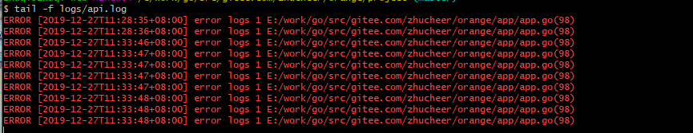

## 日志处理
orange 框架中有一个专门处理日志的包，通过使用日志包进行日志处理；
在配置文件中可以进行日志相关配置；

## 日志配置
配置文件中默认日志配置如下：
- 日志级别包含  DEBUG，INFO，NOTICE， WARNING，ERROR， CRITICAL，日志级别逐个上述，当配置指定级别后，则只会输出大于等于当前级别的日志信息；
- 日志类型 有两种 text 和 json 分别对应 json 日志类型和 文本日志类型；
- 日志路径，这里注意填写一个目录地址，默认日志会在当前配置的目录中生成；
- 日志存储支持定时同步，防止日志写入过快导致的系统开销，syncInterval的单位是**毫秒** syncInterval = 0 则实时同；步日志到日志文件 ，syncInterval = 500 则会将日志暂存到 buffer 中，每间隔 500ms 的时间将日志数据同步到日志文件。


```
[app.logger]
    level = "INFO" // 日志级别
    type = "text" // 类型 
    path = "" // 路径
    syncInterval = 500 // 日志同步时间间隔 （单位：毫秒）

```

## 快速使用
> 日志记录方法参数和 fmt.Sprintf() 一样，第一个参数是格式化内容，可以包含 %s,%d,%v 等通配符，后面的参数则是具体需要替换的数据；
> 日志默认会存储在配置的目录下，日志文件名是 default.log

一般在程序中我们使用如下的方式记录日志：
~~~
logger.Info("this is a Infolog %v", info)
logger.Error("this is a Errorlog %v", err)
logger.Warning("this is a Warning log %v", warn)
~~~

## 独立日志
> 有时如果希望对指定业务进行单独的日志文件存储，可以使用 LogFile() 方法进行链式操作处理；
~~~
// 此方法会将日志文件记录在配置目录下的 api.log 文件中
logger.LogFile("api").Error("error logs %d", err)
~~~


## 日志效果




