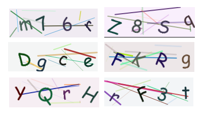

## 图片验证码
orange 图片验证码能快速生成字符类型的图片验证码，通过sessioin存储对验证码进行校验。


### 快速使用
- 使用前先将配置中的 session 功能开启；
- 在控制器方法中添加
```
// 第一个参数是控制器方法中的 context
// 第二个参数是生成的字符个数 一般4-6
// 第三，四个参数是图片的宽，高，可以不填，默认尺寸是180*60
return captcha.CaptchaImgShow(c  *app.Context,  n  int,  width height int)

// 一个控制器的完整例子
func Captcha(c *app.Context) error {
   return captcha.CaptchaImgShow(c, 4)
}
```

- 校验验证码正确性
~~~
// 这是一个控制器函数
func VerifyImg(c *app.Context) error {
   // 获取 GET 参数中的验证码 
   code := c.Request().FormValue("code")

  // 校验验证码的正确性，返回值是布尔类型
   ret:= captcha.CaptchaVerify(c, code)

   return c.ToJson(map[string]interface{}{
      "result": ret,
   })
}
~~~

图片验证码效果图预览



